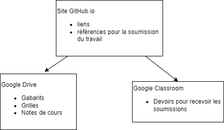

# Robotique 3M et 4M
Cours de M. Crowley

Ce répertoire contient le site public pour le cours de robotique 3M et 4M. Vous y trouverez les notes de cours, les devoirs, les projets, etc.

Le site vise à structurer des liens vers des documents sur Google Drive (éventuellement migré vers des sous-pages) et des références à trouver le devoir dans Google Classroom pour soumettre le travail.

