[Accueil](./index.md) > [3M](./acceuil3M.md#projet-2--circuits-électroniques-et-programmation)

# Projet 2 - Activité 1 : circuits et composants de base

## Objectif

* Réviser les notions de base en électricité
* Créer un circuit de base avec le matériel utilisé avec les trousses d'électronique

## Matériel

Nom | Diagramme | Image 
--- | --- | ---
1 Carte Arduino Uno | 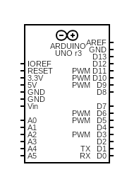 | 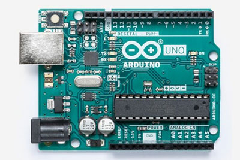
1 Câble USB |  | 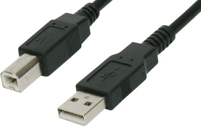
1 Bouton-poussoir | 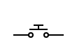 | 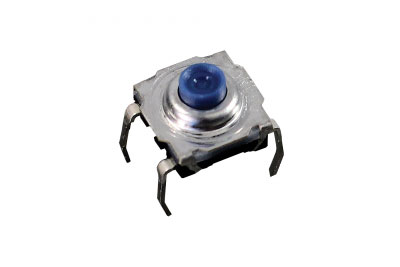
1 DEL | 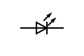 | 
1 Résistance de 220 ohms (code couleur : rouge, rouge, marron/brun, or) | 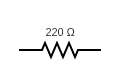 | 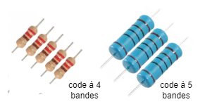
1 Plaque d'essai |  | 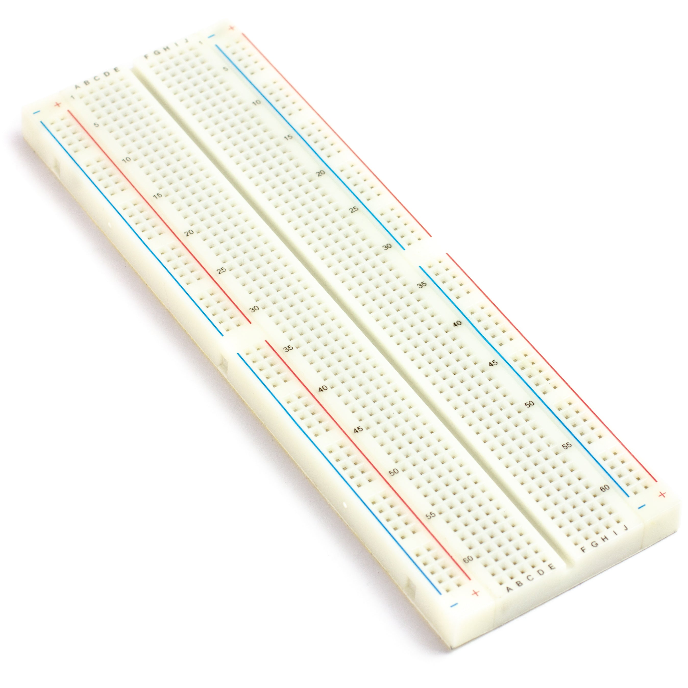

## Concepts pertinents

Vous devrez être familier avec le contenu des [notes sur les composants de base en électronique](./p2-3m_notes_composants.md).  

## Créer un circuit de base

Insérer le bouton-poussoir, la résistance et la DEL dans la plaque d'essai. Connecter les composants selon le schéma du circuit. Ensuite, brancher la carte Arduino à l'ordinateur avec le câble USB. L'ordinateur devient la source d'énergie et la carte Arduino offre des prises de 5V, de 3.3V et de masse (GND) pour alimenter le circuit.

La DEL devrait être éteinte. Quand vous appuyer sur le bouton-poussoir, la DEL devrait s'allumer. Relâcher le bouton-poussoir. La DEL devrait s'éteindre.

### Schéma du circuit

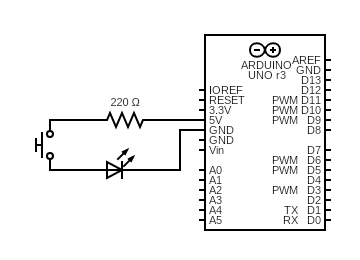

### Image du circuit

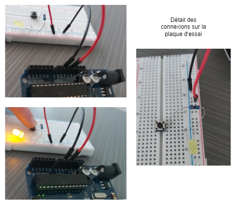

### Soumettre votre travail

Prendre une vidéo du circuit en action. Soumettre la vidéo dans le devoir sur Google Classroom.
