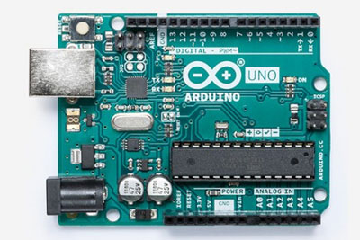
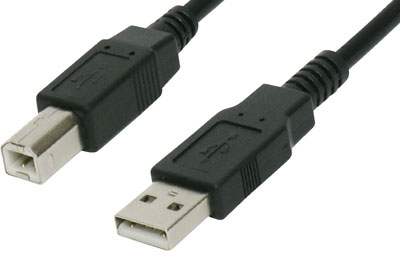
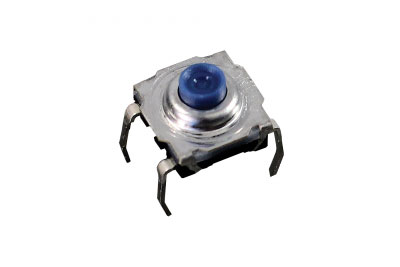
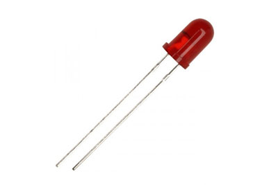
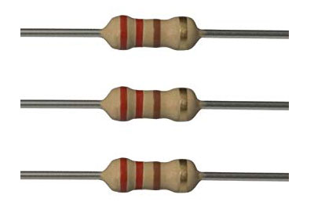
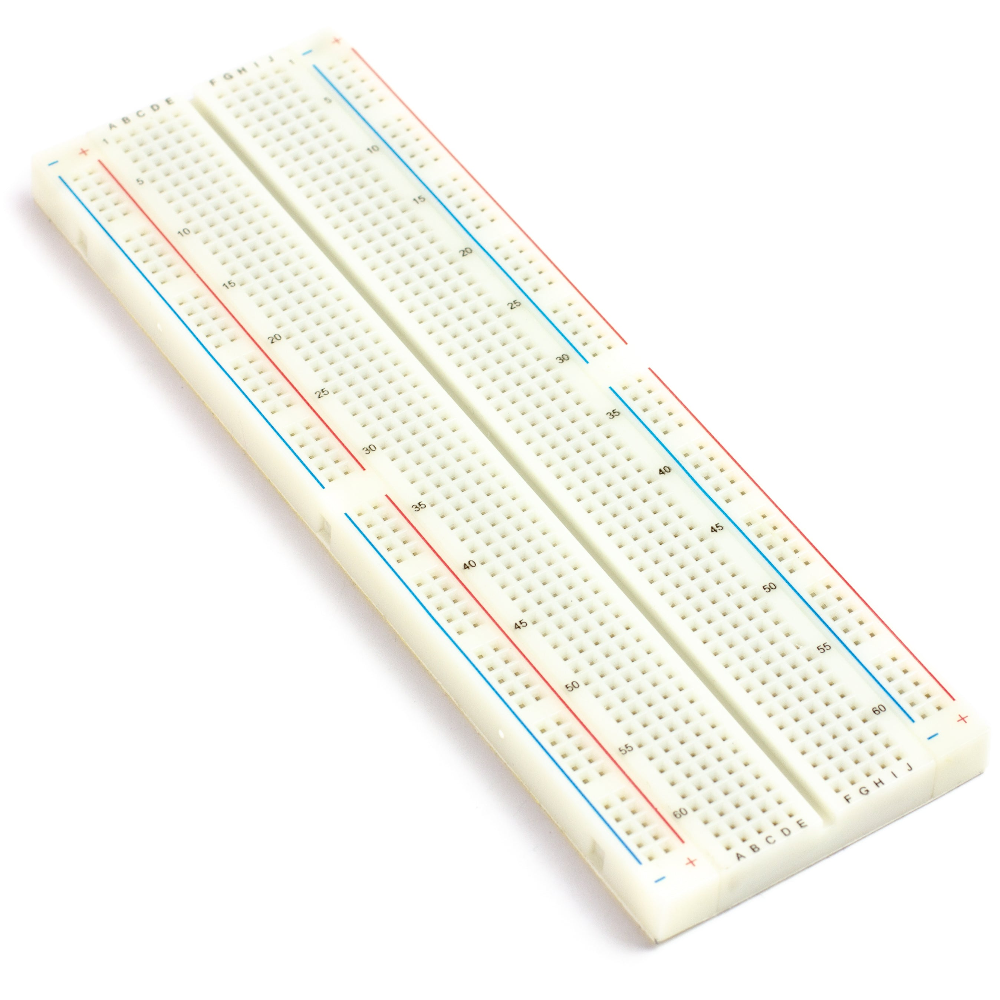
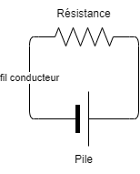
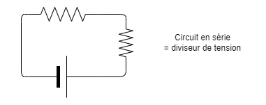
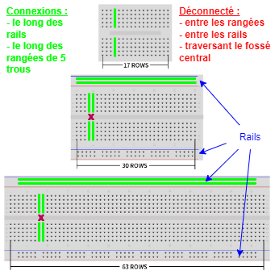

# Électronique - Activité 1 : circuits de base

## Objectif

* Réviser les notions de base en électricité
* Créer un circuit de base avec le matériel utilisé avec les trousses d'électronique

## Matériel

Nom | Image
--- | ---
1 Carte Arduino Uno | 
1 Câble USB | 
1 Bouton-poussoir | 
1 DEL | 
1 Résistance de 220 ohms (code couleur : rouge, rouge, violet, or) | 
1 Plaque d'essai | 

## Révision

### Concepts électriques

#### Circuit électrique

Un circuit électrique est un chemin fermé par lequel circule un courant électrique. Il est composé de plusieurs éléments :
1. Une source d'énergie, qui fournit le courant électrique. Par exemple une pile ou une batterie.
2. Un conducteur, qui transporte le courant électrique. Par exemple un fil de cuivre.
3. Un récepteur, qui utilise le courant électrique. Par exemple une DEL ou un moteur.

> **Note :** C'est important que le récepteur ait la capacité de consommer l'énergie fournie par la source d'énergie. Sinon, on peut endommager ou détruire la source d'énergie et/ou le récepteur.

#### Diviseurs de tension

Un circuit qui divise la tension place plusieurs récepteurs **en série**. Chaque récepteur reçoit une partie de la tension totale. L'effet est que la résistance totale du circuit augmente et le courant diminue. 

C'est parfois nécessaire d'ajouter des résistances pour limiter le courant dans un circuit afin de protéger les composants. C'est une application classique des diviseurs de tension.

#### Diviseurs de courant

Un circuit qui divise le courant place plusieurs récepteurs **en parallèle**. Chaque récepteur reçoit une partie du courant total mais avec la tension totale de la source. L'effet est que la source d'énergie doit fournir plus de courant pour alimenter tous les récepteurs.

### Comprendre les composants

#### Plaque d'essai
Une plaque d'essai est un support pour les composants électroniques. Elle permet de créer des circuits temporaires sans souder les composants. Les trous sont connectés horizontalement et verticalement selon un schéma standard.

On crée des circuits en insérant des fils monobrin ou les broches des composants dans les trous, en s'assurant de connecter les composants selon le circuit désiré.

Voici une vidéo qui explique comment utiliser une plaque d'essai :

<iframe width="560" height="315" src="https://www.youtube.com/embed/6WReFkfrUIk?si=HZpOz4fT5xvs9U80" title="YouTube video player" frameborder="0" allow="accelerometer; autoplay; clipboard-write; encrypted-media; gyroscope; picture-in-picture; web-share" allowfullscreen></iframe>

#### DEL

Un DEL est une diode électroluminescente. C'est un composant qui émet de la lumière lorsqu'il est traversé par un courant électrique. Il est polarisé, c'est-à-dire qu'il a un sens de branchement. Il faut donc le brancher dans le bon sens pour qu'il fonctionne.

La longue patte de la DEL est la patte positive. Elle doit être connectée au courant positif pour que la DEL s'allume. La patte négative est la patte la plus courte.

#### Résistance

Les résistances consomment de l'énergie électrique et sont généralement utilisées pour diminuer le courant ou la tension pour protéger les composants.

Notamment, les DEL ne peuvent pas survivre à des tensions trop élevées et la carte Arduino ne peut pas survivre à des courants trop élevés. Chaque composant a des intervalles de tension et de courant à respecter et on peut trouver ces informations dans les spécifications techniques du composant.

Par exemple, voici [les spécifications pour un affichage DEL 7 segments](https://docs.rs-online.com/b51e/0900766b801bf827.pdf).

#### Bouton-poussoir

Un bouton poussoir est un interrupteur qui se ferme lorsqu'on appuie dessus. Il est souvent utilisé pour démarrer ou arrêter un circuit.

## Activité - Créer un circuit de base

### Schéma du circuit

...à venir

### Image du circuit

...à venir

### Description du circuit
Brancher la carte Arduino à l'ordinateur avec le câble USB. L'ordinateur devient la source d'énergie et la carte Arduino offre des prises de 5V, de 3.3V et de masse (GND). 

Insérer le bouton-poussoir, la résistance et la DEL dans la plaque d'essai. Connecter les composants selon le schéma du circuit.

La DEL devrait être éteinte. Quand vous appuyer sur le bouton-poussoir, la DEL devrait s'allumer. Relâcher le bouton-poussoir. La DEL devrait s'éteindre.

### Soumettre votre travail

Prendre une vidéo du circuit en action. Soumettre la vidéo dans le devoir sur Google Classroom.
