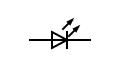

# Projet 2 - Activité 1 : circuits et composants de base

## Objectif

* Se familiariser avec l'architecture de la carte Arduino Uno.
* Apprendre comment la logique logicielle simplifie la création et la modification de circuits électroniques.

## Matériel

Nom | Diagramme | Image
--- | --- | ---
1 Carte Arduino Uno |  | 
1 Câble USB |  | 
1 Diode électroluminescente (DEL) |  | 
1 Résistance de 220 ohms (code couleur : rouge, rouge, marron/brun, or) |  | 
1 Plaque d'essai |  | 

## Concepts pertinents

Vous devrez être familier avec le contenu des [notes sur la carte Arduino Uno](./p2-3m_notes_composants.md#arduino-uno).

## Créer

