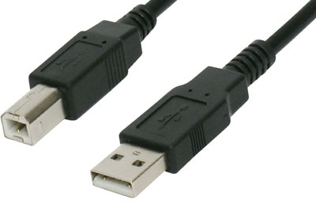
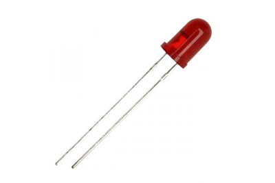
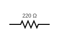

[Accueil](./index.md) > [3M](./acceuil3M.md#projet-2--circuits-électroniques-et-programmation)

# Projet 2 - Activité 3 : pourquoi utiliser un microcontrôleur comme l'Arduino?

## Objectif

* Se familiariser avec l'architecture de la carte Arduino Uno.
* Apprendre comment la logique logicielle simplifie la création et la modification de circuits électroniques.

## Matériel

Nom | Diagramme | Image
--- | --- | ---
1 Carte Arduino Uno |  | 
1 Câble USB |  | 
1 Diode électroluminescente (DEL) |  | 
1 Résistance de 220 ohms (code couleur : rouge, rouge, marron/brun, or) |  | 
1 Mini plaque d'essai |  | 

## Concepts pertinents

Vous devrez être familier avec le contenu des [notes sur la carte Arduino Uno](./p2-3m_notes_composants.md#arduino-uno).

## Créer le circuit

Insérez la patte longue (+) de la DEL dans la broche 13 de la carte Arduino et la patte courte dans une rangée de la plaque d'essai. Insérez la résistance dans la même rangée que la patte courte de la DEL. Connectez l'autre extrémité de la résistance à la rangée de la masse (GND) de la carte Arduino. Branchez la carte Arduino à l'ordinateur avec le câble USB.

### Schéma


### Image


## Premier comportement

Ici on veut simplement allumer la lumière en continu.

1. Copiez et collez le code suivant dans un nouveau projet nommé `why-uno`. Ne vous préoccupez pas trop des détails. On les étudiera dans les prochaines activités.

    > _Note_ - Ce code remplace : le code dans le fichier `why-uno.ino` qui est créé automatiquement par l'IDE Arduino -**OU**- le code dans le fichier `main.cpp` qui est créé automatiquement par PlatformIO.

    ```cpp
    #include <Arduino.h>

    const int DEL = 13;

    void setup() {
        pinMode(DEL, OUTPUT);
    }

    void loop() {
        digitalWrite(DEL, HIGH);
        delay(1000);
    }
    ```

1. Compiler, transféez et exécutez le programme sur la carte Arduino Uno.
1. Observer le comportement de la DEL.

## Deuxième comportement

Maintenant, on veut que la lumière clignote 1000ms (1s) allumée et 100ms éteinte.

1. Ajoutez les deux dernières lignes de la fonction `void loop()` à votre projet `why-uno`. 
    > Faites attention de **placer ces lignes avant l'accolade fermante `}`** afin d'assurer qu'elle soient incluses dans fonction `void loop()`.

    ```cpp
    #include <Arduino.h>

    const int DEL = 13;

    void setup() {
        pinMode(DEL, OUTPUT);
    }

    void loop() {
        digitalWrite(DEL, HIGH);
        delay(1000);
        digitalWrite(DEL, LOW); // ces deux lignes sont nouvelles
        delay(100);
    }
    ```

1. Compiler, transféez et exécutez le programme sur la carte Arduino Uno.
1. Observer le comportement de la DEL.

### Solution sans Arduino
Savez-vous comment on aurait pu faire clignoter la DEL sans utiliser le programme (sans besoin d'un microcontrôleur)? La vidéo suivante propose une solution :

<iframe width="560" height="315" src="https://www.youtube.com/embed/Gemt6ZBTNnw?si=Et2gjRALvSvjj0PM" title="YouTube video player" frameborder="0" allow="accelerometer; autoplay; clipboard-write; encrypted-media; gyroscope; picture-in-picture; web-share" allowfullscreen></iframe>

## Soumettre le travail

Créez un nouveau document dans Google Docs. 

Répondez aux questions suivantes qui comparent votre expérience à modifier le comportement avec Arduino et celle montrée dans la vidéo appliquant des connaissances en électronique analogique.

1. Si à la place d'une plaque d'essai on soudait les composants ensemble en permanence :
    1. est-ce que la modification qu'on a faite avec Arduino serait différente?
    1. est-ce que la modification à faire avec les composants électroniques serait différente?
    1. Quelle modification est plus facile à faire?
    1. Quelle modification est la moins chère ($) à faire?
1. Quel degré de connaissance des principes de l'électronique sont nécessaires pour apporter les deux types de modifications (programme Arduino versus circuit électronique pur)?
1. Si on prenait un objet existant (une horloge numérique, un vieux jouet, etc.) et qu'on voulait le modifier pour qu'il se comporte différement, quelle méthode seriez-vous le plus à l'aise à essayer? Enumérez les raisons.

Soumettez le document dans la tâche appropriée sur Google Classroom.