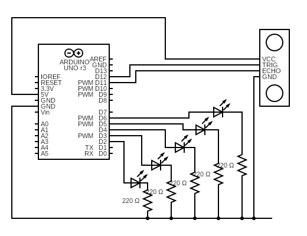
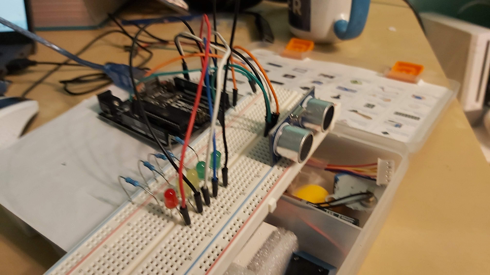
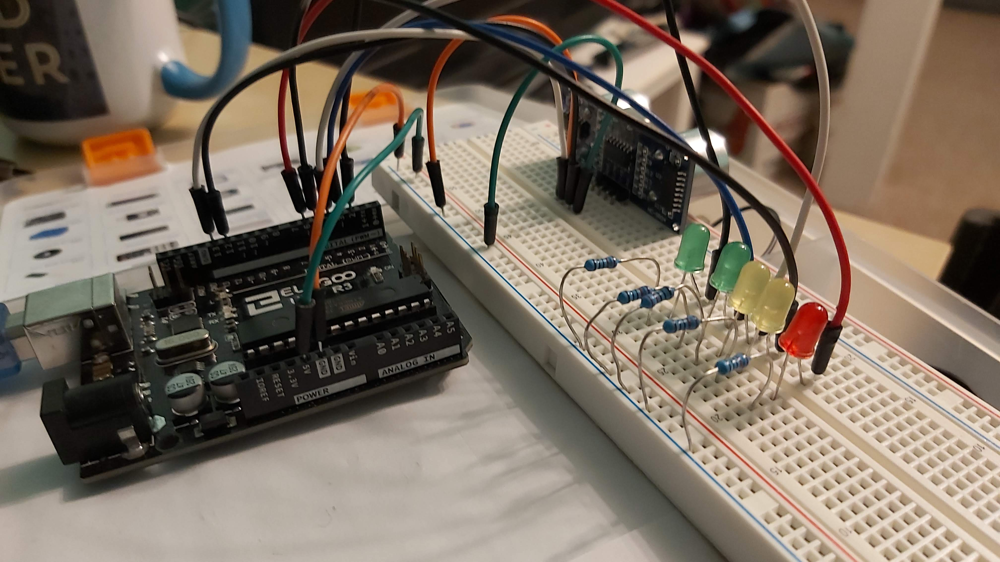

[Accueil](./index.md) > [3M](./acceuil3M.md#projet-2--circuits-électroniques-et-programmation)

# Projet 2 - Activité 3 : pourquoi utiliser un microcontrôleur comme l'Arduino?

## Objectif

- Se familiariser avec le capteur de distance à ultrasons HC-SR04.
- Appliquer les concepts de programmation de base (la logique conditionnelle) pour contrôler les indicateur lumineux

## Matériel

- 1 carte Arduino Uno
- 1 fil USB pour relier la carte à l'ordinateur
- 1 capteur de distance à ultrasons HC-SR04
- 2 DEL vertes
- 2 DEL jaunes
- 1 DEL rouge
- 5 résistances de 220 ohms
- 1 plaque d'essai
- fils de raccordement

## Schéma

## Image

## Instructions

- Monter le circuit comme illustré dans le schéma et dans les images ci-dessus.
- Ouvrir l'exemple `distance-leds` dans votre environnement de développement Arduino.
  - Version Arduino IDE : [distance-leds.ino](./code/arduinoide/distance-leds/distance-leds.ino)
  - Version PlatformIO : [distance-leds-pio.zip](./code/platformio/distance-leds-pio.zip)
- Vérifier et téléverser le code sur l'Arduino. Le code de démarrage ne contrôle qu'une seule DEL.
- Compléter le code selon le commentaire `TODO` dans le fichier `distance-leds.ino`. Notamment, ajouter les instructions pour allumer les autres DELs en fonction de la distance mesurée par le capteur de distance à ultrasons. 
    - La première DEL à s'allumer (verte) le fait quand la distance est moins que 150cm.
    - La deuxième DEL à s'allumer (verte encore) le fait quand la distance est moins que 100cm.
    - La troisième DEL à s'allumer (jaune) le fait quand la distance est moins que 50cm.
    - La quatrième DEL à s'allumer (jaune encore) le fait quand la distance est moins que 20cm.
    - La dernière DEL à s'allumer (rouge) le fait quand la distance est moins que 10cm.

## Projet de conception

Une fois que votre code pour la section précédente fonctionne, valider le tout avec l'enseignant. Si l'enseignant est satisfait que votre code fonctionne, vous pouvez passer au paragraphe suivant. Sinon, corriger les erreurs avant de continuer.

Pour le projet final, votre défi est d'utiliser ce que vous avez fait précédemment mais en clignotant le dernier DEL allumé. Par exemple, si la distance est inférieure à 10 cm, tous les DEL sont allumés mais la DEL rouge clignote. Si la distance est plus loin que 150cm, aucune DEL n'est allumée et aucune ne clignote.

<blockquote>
<h3>Description de la logique pour une solution potentielle</h3>
<ul> 
    <li>Ajouter une variable <code>int lastLed;</code> dans la fonction <code>loop()</code> avant la série de conditions <code>if () {} else {}</code></li>
    <li>Assurez-vous d'avoir placé toutes les conditions en ordre décroissant de distance (de la plus grande distance à la plus petite distance), sinon les placer dans cet ordre.</li>
    <li>Dans chaque bloc <code>if</code>, ajoutez une autre instruction après l'instruction pour allumer la DEL, soit : <code>lastLed = ledN;</code> où vous remplacez <code>N</code> avec le numéro de chaque DEL.</li>
    <li>Une fois que vous avez passé à travers toutes les conditions, la dernière fois que la condition est vrai vous donne la bonne DEL dans la variable <code>lastLed</code>.</li>
    <li>Vous pourrez alors ajouter les instructions que vous avez déjà vu pour clignoter une DEL à la fin de la fonction <code>loop()</code> en utilisant <code>lastLed</code> comme référence pour la bonne broche.</li>
</ul>
</blockquote>

## Soumettre le travail

Prendre **une vidéo** de votre montage final en action et la soumettre dans la tâche appropriée dans Google Classroom.

Ajoutez également votre **code final** (le fichier `.ino` ou `.cpp`) dans la tâche appropriée dans Google Classroom.
