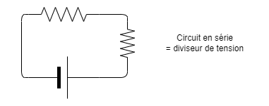

[Accueil](./index.md) > [3M](./acceuil3M.md#projet-2--circuits-électroniques-et-programmation)

# Notes : Composants électroniques de base

En robotique, nos programmes sont convertis en actions **par des circuits électroniques**, que ce soit pour capter des données ou pour actionner des moteurs.

Ces notes sont directement applicables si :
* vous voulez faire des projets d'électronique à la maison utilisant des composants standards et peu chers
* vous avez envi d'apprendre comment utiliser un microcontrôleur comme l'Arduino, le Raspberry Pi ou l'ESP32
* vous pensez à une carrière en génie électrique ou en robotique où la connaissance des composants électroniques est essentielle

Ces notes couvrent les sujets suivants en guise d'introduction à l'électronique :
* [les circuits électriques de base](#circuits-électriques-de-base)
* [les composants électroniques de base](#composants-électroniques-de-base)
* [l'Arduino Uno, un microcontrôleur populaire](#arduino-uno)

> Avec la trousse de robotique LEGO EV3 Mindstorms, la plupart de ce que nous verrons dans cette unité est masqué afin de simplifier l'expérience de l'utilisateur. Par contre, ces notes vous aideront à comprendre ce qui se passe sous le capot et peuvent vous aider à résoudre des problèmes plus complexes.

## Circuits électriques de base

Un circuit électrique est un chemin fermé par lequel circule un courant électrique. Il est composé de plusieurs éléments :
1. Une source d'énergie, qui fournit le courant électrique. Par exemple une pile ou une batterie.
2. Un conducteur, qui transporte le courant électrique. Par exemple un fil de cuivre.
3. Un récepteur, qui utilise le courant électrique. Par exemple une DEL ou un moteur.

> **Note :** C'est important que le récepteur ait la capacité de consommer l'énergie fournie par la source d'énergie. Sinon, on peut endommager ou détruire la source d'énergie et/ou le récepteur.

#### Diviseurs de tension

Un circuit qui divise la tension place plusieurs récepteurs **en série**. Chaque récepteur reçoit une partie de la tension totale. L'effet est que la résistance totale du circuit augmente et le courant diminue. 

C'est parfois nécessaire d'ajouter des résistances **pour limiter le courant dans un circuit** afin de protéger les composants. C'est une application classique des diviseurs de tension. Pour déterminer le courant, on peut utiliser la **Loi d'Ohm** : `I = V / R` où `I` est le courant, `V` est la tension (généralement 5 volts) et `R` est la somme des résistances dans le circuit.

#### Diviseurs de courant

Un circuit qui divise le courant place plusieurs récepteurs **en parallèle**. Chaque récepteur reçoit une partie du courant total mais avec la tension totale de la source. L'effet est que la source d'énergie doit fournir plus de courant pour alimenter tous les récepteurs.

Pour connaître le courant qui sera sollicité par la source d'énergie, vous pouvez appliquer la Loi d'Ohm sur chaque branche du circuit et ensuite faire la somme des courants, soit `I_tot = I_1 + I_2 + ...` où `I_tot` est le courant total et les autres `I` sont des courants sur les branches individuelles. Si le courant est trop élévé pour la capacité de la source d'énergie, vous pouvez ajouter une résistance avant ou après le diviseur de courant pour le réduire.

## Composants électroniques de base

* [Plaque d'essai](#plaque-d'essai)
* [DEL](#del)
* [Résistance](#résistance)
* [Bouton-poussoir](#bouton-poussoir)

#### Plaque d'essai
Une plaque d'essai est un support pour les composants électroniques. Elle permet de créer des circuits temporaires sans souder les composants. Les trous sont connectés horizontalement et verticalement selon un schéma standard.

On crée des circuits en insérant des fils monobrin ou les broches des composants dans les trous, en s'assurant de connecter les composants selon le circuit désiré.

Voici une vidéo qui explique comment utiliser une plaque d'essai :

<iframe width="560" height="315" src="https://www.youtube.com/embed/6WReFkfrUIk?si=HZpOz4fT5xvs9U80" title="YouTube video player" frameborder="0" allow="accelerometer; autoplay; clipboard-write; encrypted-media; gyroscope; picture-in-picture; web-share" allowfullscreen></iframe>

#### DEL

Un DEL est une diode électroluminescente. C'est un composant qui émet de la lumière lorsqu'il est traversé par un courant électrique. Il est polarisé, c'est-à-dire qu'il a un sens de branchement. Il faut donc le brancher dans le bon sens pour qu'il fonctionne.

La longue patte de la DEL est la patte positive. Elle doit être connectée au courant positif pour que la DEL s'allume. La patte négative est la patte la plus courte.

#### Résistance

Les résistances consomment de l'énergie électrique et sont généralement utilisées pour diminuer le courant ou la tension pour protéger les composants.

Notamment, les DEL ne peuvent pas survivre à des tensions trop élevées et la carte Arduino ne peut pas survivre à des courants trop élevés. Chaque composant a des intervalles de tension et de courant à respecter et on peut trouver ces informations dans les spécifications techniques du composant.

Par exemple, voici [les spécifications pour un affichage DEL 7 segments](https://docs.rs-online.com/b51e/0900766b801bf827.pdf).

La valeur d'une résistance est indiquée par un code de bandes de couleurs. Le tableau suivant, en couleurs plus naturelles, peut vous aider à identifier la couleur de chaque bande sur une résistances :

_source : [FabLabUTC](https://fablabutc.fr/wp-content/uploads/2021/01/Tutoriel_Electronique-Generale-3.pdf)_

Le [calculateur de résistances sur le site de DigiKey](https://www.digikey.ca/fr/resources/conversion-calculators/conversion-calculator-resistor-color-code-4-band), un fournisseur important de composants électroniques en Amérique du Nord, peut faire le calcul de la résistance si vous connaissez les couleurs. Il y a un onglet pour les résistances de 4 bandes et un autre pour les résistances de 5 bandes. 

P. ex. pour une résistance de 220 ohms à 4 bandes les couleurs sont rouge, rouge, brun/marron _et or (±5%)_; mais avec 5 bandes les couleurs sont rouge, rouge, noir, noir _et rouge (±2%)_.

#### Bouton-poussoir

Un bouton poussoir est un interrupteur qui se ferme lorsqu'on appuie dessus. Il est souvent utilisé pour démarrer ou arrêter un circuit.

## Arduino Uno

L'Arduino Uno est un microcontrôleur populaire pour les projets d'électronique. Il est basé sur un microcontrôleur ATmega328P de la compagnie Microchip. Il est programmable en C++ et est compatible avec plusieurs capteurs et actionneurs. Il y a aussi plusieurs environnement de développement intégrés (IDE) pour programmer l'Arduino, dont l'IDE Arduino - le plus populaire pour les novices - et Visual Studio Code avec l'extension PlatformIO qui fonctionne également avec d'autres microcontrôleurs dont l'ESP32.

* [Comprendre les composants sur la carte](#comprendre-les-composants-sur-la-carte)
* [Alimentation](#alimentation)
* [Communication série](#communication-série)
* [Broches numériques](#broches-numériques)
* [Broches analogiques](#broches-analogiques)
* [Broches numériques à modulation de largeur d'impulsion (PWM)](#broches-numériques-à-modulation-de-largeur-d'impulsion-(PWM))

### Comprendre les composants sur la carte

### Broches numériques

### Broches analogiques

### Broches numériques à modulation de largeur d'impulsion (PWM)

### Alimentation

### Communication série

