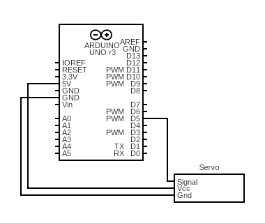

[Accueil](./index.md) > [4M](./acceuil4M.md#projet-2--circuits-électroniques-et-programmation)

# Projet 2, Activité 3 : Servomoteurs, moteurs à courant continu et moteurs pas-à-pas

## Objectif

- Comprendre les différences concrètes entre les servomoteurs, les moteurs à courant continu et les moteurs pas-à-pas.
- Apprendre à contrôler ces moteurs avec un microcontrôleur.

## Servomoteurs

### Introduction aux servomoteurs

Consultez la vidéo d'introduction suivante :

> 🚧 à ajouter

### Activité

#### Matériel

- 1 servomoteur 9g
- 1 servomoteur Parallax à rotation continue
- 1 bras de servomoteur (pour voir la position/le mouvement)
- 3 fils de raccordement
- 1 carte Arduino Uno
- 1 fil USB pour relier la carte à l'ordinateur

#### Schéma

Connectez le servomoteur à la carte Arduino Uno selon le schéma suivant :

Testez un servomoteur à la fois en utilisant les mêmes branchements. Commencez par le servomoteur 9g.

#### Instructions

1. Ouvrir l'exemple servo-test dans votre environnement de développement Arduino.
   - Version Arduino IDE : [servo-test.zip](./code/arduinoide/servo-test.zip)
   - Version PlatformIO : [servo-test-pio.zip](./code/platformio/servo-test-pio.zip)
1. Masquer tout le code actif dans `setup()` (après la connexion du servomoteur) et dans `loop()` derrière un commentaire (sélectionner le code et appuyer sur `Ctrl` + `é` pour commenter/décommenter). 
1. Ajouter une seule commande `stopMotor()` dans `setup()`. Quand la position du bras s'immobilise, attachez le bras au servomoteur afin qu'il soit parallèle au corps du servomoteur.
1. Démasquer le code original et ajustez les valeurs pour les signaux `LEFT` et `RIGHT` pour que le bras de servomoteur soit à 90°, 0° (limite de rotation anithoraire) et 180° (limite de rotation horaire) respectivement.
1. Filmez le comportment du servomoteur.
1. Répétez les étapes 2 à 5 pour le servomoteur Parallax à rotation continue mais avec les ajustements suivants :
    - Si le moteur n'est pas immobile avec la commande `stopMotor()` à l'étape 3, utiliser un tournevis pour ajuster le potentiomètre sur le servomoteur (la vis jaune)  jusqu'à ce qu'il s'immobilise. Cela calibre le moteur correctement.
    - Les valeurs de `LEFT` et `RIGHT` ne sont pas les mêmes que pour le servomoteur 9g. En fait, ils devraient se trouvent dans l'intervalle de 1300 à 1700. Ajustez-les pour que le moteur soit immobile à 1500 et tourne dans une direction à 1300 et dans l'autre direction à 1700.

## Moteurs à courant continu

### Introduction aux moteurs à courant continu et à la puce L9110H

### Activité

🚧 Suivre ces instructions :

[tiré du manuel pour notre trousse de pièces](https://www.manualslib.com/manual/1810234/Uctronics-Ultimate-Starter-Kit-For-Arduino.html?page=38#manual)

[détails sur la puce L9110H](https://cdn-shop.adafruit.com/product-files/4489/4489_datasheet-l9110.pdf)

Obtenir le code ici : [Activité 13 sur la page GitHub d'UCTronics](https://github.com/UCTRONICS/uctronics_arduino_kits/blob/master/Code/Lesson_13_Controlling_DC_motor/Lesson_13_Controlling_DC_motor.ino)

#### Matériel

#### Schéma

#### Instructions

## Moteurs pas-à-pas

### Introduction aux moteurs pas-à-pas et au module de contrôle ULN2003

### Activité

🚧 Suivre ces instructions :

[tiré du manuel pour notre trousse de pièces](https://www.manualslib.com/manual/1810234/Uctronics-Ultimate-Starter-Kit-For-Arduino.html?page=40#manual)

Obtenir le code ici : [Activité 14 sur la page GitHub d'UCTronics](https://github.com/UCTRONICS/uctronics_arduino_kits/blob/master/Code/Lesson_14_Controlling_Stepper_Motor/Lesson_14_Controlling_Stepper_Motor.ino)

#### Matériel

#### Schéma

#### Instructions
