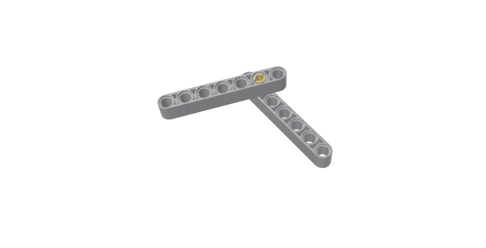

[Accueil](./index.md) > [3M](./acceuil3M.md#projet-3--structures-mécaniques)

# Notes : Structures mécaniques avec LEGO

Le corps et tous les membres d'un robot sont des structures mécaniques. Les structures mécaniques sont des assemblages de pièces qui supportent des charges et des mouvements. Elles sont conçues pour résister à des forces et des moments spécifiques. Les structures mécaniques sont souvent fabriquées à partir de matériaux comme le plastique, le métal, le bois, le béton, etc.

Comme initiation au sujet, nous utiliserons les pièces de votre trousse LEGO EV3 pour expliquer les concepts de base des structures mécaniques.

Ces notes couvrent les sujets suivants  :

- [Joints mobiles](#joints-mobiles)
- [Joints fixes](#joints-fixes)
- [Cadres](#cadres)

## Joints mobiles

_[Joints fixes](#joints-fixes) | [Cadres](#cadres)_

Il y a deux types de connecteurs LEGO : ceux avec friction et ceux sans friction. Les connecteurs avec friction sont utilisés pour les joints fixes, tandis que les connecteurs sans friction sont utilisés pour les joints mobiles.

## Joints fixes

_[Joints mobiles](#joints-mobiles) | [Cadres](#cadres)_

## Cadres

_[Joints mobiles](#joints-mobiles) | [Joints fixes](#joints-fixes)_

