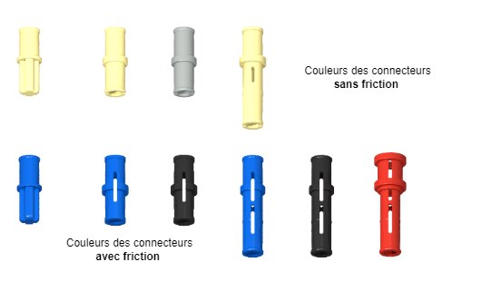

[Accueil](./index.md) > [3M](./acceuil3M.md#projet-3--structures-mécaniques)

# Notes : Structures mécaniques avec LEGO

Le corps et tous les membres d'un robot sont des structures mécaniques. Les structures mécaniques sont des assemblages de pièces qui supportent des charges et des mouvements. Elles sont conçues pour résister à des forces et des moments spécifiques. Les structures mécaniques sont souvent fabriquées à partir de matériaux comme le plastique, le métal, le bois, le béton, etc.

Comme initiation au sujet, nous utiliserons les pièces de votre trousse LEGO EV3 pour expliquer les concepts de base des structures mécaniques.

Ces notes couvrent les sujets suivants :

- [Connecteurs](#connecteurs)
- [Joints](#joints)
  - [Joints mobiles](#joints-mobiles)
  - [Joints rigides](#joints-rigides)
- [Cadres](#cadres)
  - [Cadres rigides](#cadres-fixes)
  - [Cadres mobiles (mécanismes à barres)](#cadres-mobiles)

## Connecteurs

Les connecteurs, aussi appelés **clavettes**, sont utilisés pour lier deux ou plusieurs fléaux ensemble. Il y a aussi des connecteurs pour joindre des arbres cruciformes ensemble, mais cette leçon se concentre sur les connecteurs pour les fléaux.

Il y a deux types de clavettes LEGO :

- ceux avec friction et
- ceux sans friction.

Faites donc attention de choisir le bon type de connecteur pour votre application.

- Les connecteurs **avec friction** sont utilisés pour les joints fixes, comme dans les cadres rigides.
- Les connecteurs **sans friction** sont utilisés pour les joints mobiles, comme dans les articulations.

## Joints

### Joints mobiles

Les joints mobiles relient deux pièces tout en permettant un mouvement entre les pièces. Les joints mobiles sont utilisés pour les articulations, comme les coudes, les genoux, les épaules, etc.

Le joint pivotant est le joint mobile le plus simple. Il relie deux pièces autour d'un axe commun de rotation. Ces joints peuvent être :

- **libres** : les pièces peuvent tourner librement autour du connecteur
- **actionnés** : l'actionneur est connecté à une autre pièce et contrôle son mouvement, p. ex. l'axe de rotation d'un moteur qui contrôle un bras robotique.

| Joint pivotant libre                                          | Joint pivotant actionné                                             |
| ------------------------------------------------------------- | ------------------------------------------------------------------- |
|  |  |
| membres liés par un connecteur **sans friction**              | membres liés par arbre cruciforme                                   |

### Joints rigides

Les joints rigides relient deux pièces tout en empêchant le mouvement relatif des pièces. Les joints rigides sont utilisés pour les cadres rigides ou pour prolonger un fléau.

On utilise des connecteurs **avec friction** pour tous les joints rigides.

Dans le cas d'un cadre rigide, c'est la géométrie du cadre qui empêche le mouvement entre les pièces (voir [la section ci-dessous](#cadres-rigides)).

> _Notez l'utilisation de triangles pour stabiliser le cadre. Avec LEGO, on ne peut pas former un triangle sur le même plan, alors les trois membres du triangle se trouvent sur des plans différents. Il faut souvent faire preuve de créativité pour aligner les pièces pour obtenir ce que vous voulez. (Voir aussi [la section ci-dessous](#alignement))._

Dans le cas d'un joint rigide qui prolonge un fléau, la friction des connecteurs n'est pas suffisant. On se sert alors d'au moins deux connecteurs pour prévenir le mouvement.

#### Alignement

Il faut faire attention à l'alignement des fléaux pour s'assurer d'obtenir la géométrie voulue dans un cadre ou pour positionner correctement l'extrémité d'un fléau.

Voici quelques exemples :

> _Ici on utilise deux fléaux sur le côté afin que le fléau utile soit centré. La version du haut (avec les connecteurs bleux) est un joint rigide tandis que celle du bas (avec le connecteur beige) est un joint mobile. Un connecteur spécialisé est utilisé pour stabiliser l'autre extrémité des fléaux de côté._

> _Ici, on tente de créer un cadre avec juste 3 membres, mais c'est un design impossible car on ne peut jamais aligner les trous pour le dernier joint un par dessus l'autre. Ça prend toujours au moins un autre membre pour compléter un cadre... ou bien un membre qui contient déjà un angle._

## Cadres

### Cadres rigides

Les cadres rigides forment une base de support pour les parties mobiles du robot. Ils doivent être suffisaments forts pour supporter les charges et les mouvements des autres parties du robot.

L'astuce principal pour les corps rigides avec les trousses EV3 est d'utiliser les cadres déjà fournis comme base, incluant la brique EV3 elle-même. Ces cadres sont déjà rigides et peuvent être utilisés pour construire des structures plus grandes.

Pour étendre un cadre, c'est important de s'assurer que la structure ne peut pas se déformer. Par exemple, un cadre rectangulaire peut être déformé en un parallélogramme si les diagonales ne sont pas fixées.

> _Notez que la friction fournie par les connecteurs aux joints n'est pas suffisant pour empêcher un cadre mal formé de se déformer._

Pour éviter ça, on peut ajouter des diagonales ou des renforts. Les pièces anglulaires sont des bons choix pour ça. Il y a aussi un paquet de connecteurs spéciaux pour les cadres, incluant des connecteurs en H et en L. Certaines pièces sont aussi conçues pour joindre des arbres cruciformes pour former des cadres au lieu de joindre des fléaux.

### Cadres mobiles (mécanismes à barres)

Les cadres mobiles sont des mécanismes qui permettent le mouvement d'une partie du robot. En actionnant le mouvement d'un des joints, le cadre au complet bouge selon la géométrie du cadre.

Par exemple, le parallélogramme ci-dessus (qui est un mauvais cadre rigide) est souvent utilisé avec des joints sans friction quand on veut que les deux extrémités du cadres restent toujours parallèles, comme des ascenceurs ou le bras d'une pelle mécanique. Il y a d'autres mécanismes qui amplifient le mouvement fournit par l'actionneur ou qui le transforment en un autre type de mouvement (p. ex. rotation en translation).

On explore les mécanismes à barres plus en détail dans le projet 4.
