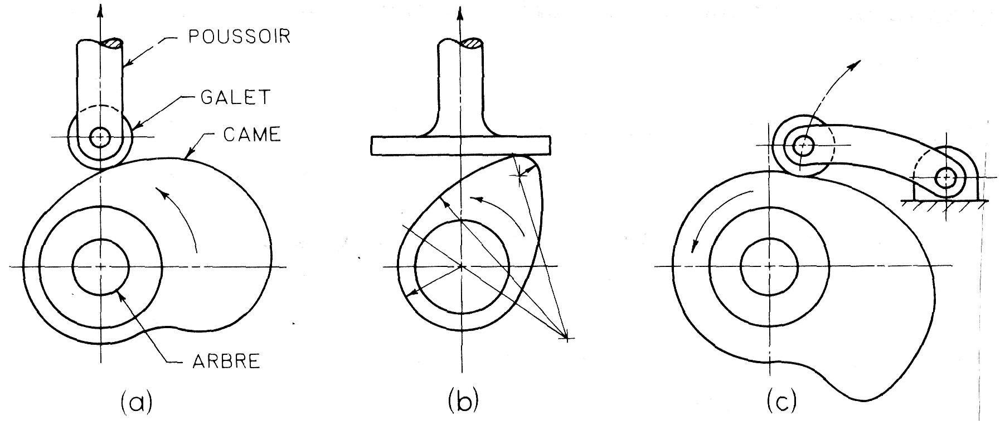

[Accueil](./index.md) > [4M](./acceuil4M.md#projet-3--structures-mécaniques)

# Notes : cames et mécanismes à barres

## Cames

Les **cames** sont des formes spéciales qui convertissent un mouvement de rotation en un mouvement sur mesure, souvent linéaire, comme pour actionner une tige-poussoir. L'idée est qu'une rotation de la came produit un cycle du mouvement voulu.

En concevant la forme de la came on peut physiquement programmer un mouvement complexe, comme soulever un pont, la garder en position haute pendant un temps fixe et la baisser lentement. Les cames sont utilisées dans les machines-outils, les moteurs à combustion interne, les machines textiles, etc.

Voici une courte vidéo montrant quelques formes possibls pour les cames :

<iframe width="560" height="315" src="https://www.youtube.com/embed/gc7lPV7oUss?si=50BGF7Gek2pqnekU" title="YouTube video player" frameborder="0" allow="accelerometer; autoplay; clipboard-write; encrypted-media; gyroscope; picture-in-picture; web-share" allowfullscreen></iframe>

## Mécanismes à barres

Voici la terminologie des différents éléments d'un mécanisme à barres :

- **Manivelle** : une barre attachée au cadre qui fait des rotations complètes, souvent actionné par un moteur
- **Oscillateur** : une barre attachée au cadre qui fait des va-et-vient
- **Cadre** : une structure rigide liant le mécanisme au reste de la machine. En tant que "barre" on trace la droite entre les deux joints du mécanisme qui sont fixés sur la machine.
- **Bielle** : une barre qui n'est pas attaché au cadre mais à deux autres barres mobiles; l'extrémité du mécanisme. Son mouvement peut être de type oscillateur ou de type manivelle selon la géométrie du mécanisme.

Voici une courte vidéo montrant la variété des mouvements possibles avec un mécanisme à barres :

<iframe width="560" height="315" src="https://www.youtube.com/embed/QVKzI0XSSc0?si=PstA6KbasE2XSLuO" title="YouTube video player" frameborder="0" allow="accelerometer; autoplay; clipboard-write; encrypted-media; gyroscope; picture-in-picture; web-share" allowfullscreen></iframe>

Selon le mouvement des membres joints au cadre on a ces trois types de mécanismes à barres :

- **double manivelle** - convertir un type de rotation en un autre type de rotation : [animation de la manivelle double](https://www.geogebra.org/m/yck9u4az)
- **manivelle-oscillateur** - convertir une rotation en mouvement quasi-linéaire, comme des jambes de marcheur : [animation de la manivelle-oscillateur](https://www.geogebra.org/m/avan2x7e)
- **double oscillateur** - bouger deux membres d'un cadre de manière synchrone, comme des bras robotique : [animation de l'oscillateur double](https://www.geogebra.org/m/csat6fte)

Une géométrie commune est un **parallélogramme** qui, selon le rapport de longueur des barres fixés au cadre et de la bielle, peut donner les trois types de mouvement ci-dessus. Cette géométrie est utilisée quand on veut que la bielle reste toujours parallèle au cadre, ce qui est pratique dans les applications suivantes :

- bras de pelle mécanique (en mode de soulèvement de la charge)
- bras robotique
- mécanisme de direction

Un problème commun avec le parallélogramme est la **position bistable** où tous les membres sont alignés et où le mouvement est indéterminé : les manivelles peuvent devenir oscillateurs et vice-versa. Vous pouvez le voir [dans cette animation](https://www.geogebra.org/m/quu8rsds). Pour éviter ce problème on peut ajouter un ressort, un arrêt fixe ou un autre mécanisme pour forcer le mécanisme à rester dans une position stable.
