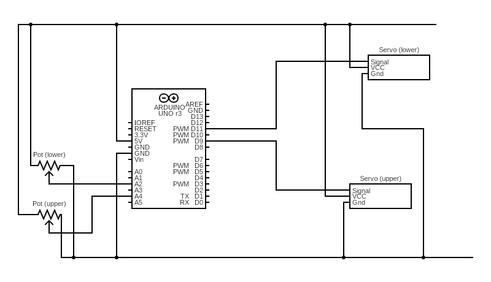
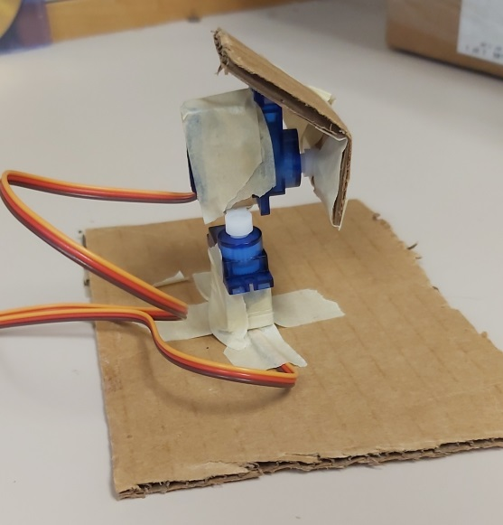

[Accueil](./index.md) > [3M](./acceuil4M.md#projet-5--systèmes-mécaniques)

# Projet 5, activité 1 : Tourelle universelle

## Objectif

Contrôler 2 servomoteurs ensemble pour créer une tourelle universelle qui peut pointer dans toutes les directions. En anglais, le terme équivalent à "tourelle universelle" est _pan-tilt mechanism_.

## Introduction

Visionner la vidéo suivante :

<iframe width="560" height="315" src="https://www.youtube.com/embed/iH9_xtulyws?si=t-pDHEEyJRlfl8Et" title="YouTube video player" frameborder="0" allow="accelerometer; autoplay; clipboard-write; encrypted-media; gyroscope; picture-in-picture; web-share" allowfullscreen></iframe>

## Matériel

- 1 carte Arduino Uno
- 2 servomoteurs 9g
- 2 potentiomètres
- carton
- ruban adhésif
- bâtonnets de bois
- ciseaux

## Instructions

### Tester le matériel et le contrôle de base

1. Connectez les servomoteurs et les potentiomètres à la carte Arduino selon le schéma suivant :
   
1. Tester vos servomoteurs et potentiomètres individuellement. Téléchargez le code ci-dessous et créer les projets PlatformIO correspondants (voir les [notes sur comment importer un projet PlatformIO](./p2-3m_act2-pio.md#utiliser-du-code-de-démarrage)) :
   > Vous avez probablement déjà une version du projet servo-test. Vous pouvez la réutiliser pour tester les servomoteurs.
   - Test pour un servomoteur : [servo-test-pio.zip](./code/platformio/servo-test-pio.zip)
   - Test pour un potentiomètre [pot-test-pio.zip](./code/platformio/pot-test-pio.zip)
1. Notez les valeurs de calibrage que vous avez obtenues pour chaque pièce. Vous aurez besoin de ces valeurs pour le code final de la tourelle.

### Assembler la tourelle

Par exemple :

1. Fixez le 1e servomoteur à une base en carton afin que **son axe soit vertical**. Le bras tournera sur le plan horizontal, nous donnant le mouvement panoramique (le _pan_ dans _pan-tilt_).
1. Ajouter un bras de servomoteur à l'axe de rotation du 1e servomoteur.
1. Fixez le 2e servomoteur à l'extrémité du bras du 1e servomoteur. Un morceau de carton comme extension du bras est pratique à cette fin. **L'axe de rotation du 2e servomoteur doit être horizontal, soit perpendiculaire à l'axe du 1e servomoteur.** Le bras du 2e servomoteur tournera sur le plan vertical nous donnant le réglage d'inclinaison (le _tilt_ dans _pan-tilt_).
1. Ajoutez un bras de servomoteur à l'axe de rotation du 2e servomoteur. 
1. Fixez un morceau de carton à l'extrémité du bras du 2e servomoteur. On peut imaginer que ce carton est un support pour une caméra ou pour un autre capteur.

> **Note importante:** C'est pratique d'attacher les bras sans les visser afin de les retirer facilement pour attacher les autres pièces (les cartons, l'autre servomoteur). Le code de démarrage vous donnera le point milieu pour chaque servomoteur, alors vous pouvez régler les bras s'ils ne sont pas attachés avec la bonne orientation. Également, si un bras bloque sur un obstacle, il peut se détacher au lieu d'endommager le servomoteur.

### Tester l'intégration matérielle et logicielle

1. Téléchargez le code de démarrage suivant et créez le projet PlatformIO correspondant :
   - [tourelle-pio.zip](./code/platformio/tourelle-pio.zip)
1. Vérifiez et téléversez le code sur votre carte Arduino. Le code de démarrage inclut l'initialisation pour tous les composants (dans `setup`) mais seulement le code pour le servomoteur du bas (dans `loop`).
1. Testez votre montage en tournant le potentiomètre pour le servo du bas ("lower").

### Modifications

#### Moteur du haut
1. Ajoutez le code nécessaire pour inclure le potentimètre et le servo du haut ("upper") - le mouvement d'inclaison.
1. Testez votre montage en tournant les deux potentiomètres. Le mécanisme devrait tourner 180 degrés sur la plan horizontal et 180 degrés sur le plan vertical.

#### Angles réduits

La bibliothèque `Servo` inclut deux commandes de contrôle : `writeMicroseconds` (celle incluse dans notre code) et `write`. La commande `write` prend un angle en degrés entre 0 et 180 ou le point zéro se trouve à 90 degrés. Cela nous permet de penser en termes d'angles au lieu d'en termes de signaux, ce qui nous aide quand on connaît les limites de mouvement à spécifier.

1. Changez les constantes pour les valeurs CCW et CC (contre-clockwise et clock-wise) pour les servomoteurs en les remplaçant avec des valeurs d'angle. Notez que CCW correspond à l'angle 0.
   - Cela affectera les instructions `map` qui produisent les signaux pour les servomoteurs
1. Changez les instructions pour la position 0 dans `setup` à `write(90)` pour chaque servomoteur.
1. Remplacez les instructions `writeMicroseconds` dans `loop` avec `write` pour les servomoteurs.
1. Ajustez les valeurs limites (les constantes CCW et CC) afin d'obtenir le mouvement désiré.

## Livrables

Demandez à l'enseignant de vérifier le fonctionnement de votre tourelle.
Prenez une vidéo de votre montage et la soumettre dans le devoir approprié sur Classroom.
