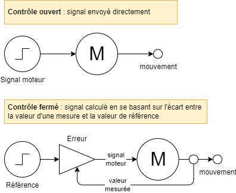

[Accueil](./index.md) > [3M](./accueil3M.md#projet-7--mouvement-avec-mission)

# Projet 3 : Suivre une ligne

## Objectifs

1. Ajouter un capteur à la base robotique afin de lui donner la capacité de suivre une ligne au sol.

## Instructions

1. Modifier la base robotique LEGO EV3 selon les instructions dans le tutoriel (lien ci-dessous).
1. Dans VS Code, **chaque membre du groupe** crée un nouveau projet EV3 nommé `line`.
   > Assurez-vous d'ajuster les paramètres dans le fichier `.vscode/settings.json` pour bien bénéficier des outils de documentation et de complétion automatique.
1. **Avant d'utiliser le code fourni**, faites d'abord le calibrage de votre capteur de lumière réfléchie en suivant les étapes ci-dessous :
   * _OPTION A : Avec la brique_
      1. Ouvrez le menu "Device Browser" > "Sensors"
      1. Sélectionnez le capteur de lumière réfléchie
      1. Cliquez le bouton "view values"
      1. Placez le capteur directement au-dessus de la bande _noire_ de la piste et notez la valeur de lumière réfléchie.
      1. Placez le capteur directement au-dessus d'une zone _blanche_ de la piste et notez la valeur de lumière réfléchie.
   * _OPTION B : Avec un programme_
      1. Téléchargez le programme [cal_refl.py](./assets/code/pybricks/cal_refl.py) et le placer dans le dossier de votre projet `line`.
      2. Téléverser le programme sur le robot puis naviguer avec le "File Browser" pour lancer le programme `~/line/cal_refl.py`.
      3. Déplacer le robot manuellement sur la piste blanc/noir afin de capter les valeurs maximales et minimales de lumière réfléchie. Peser un bouton de la face centrale pour arrêter les mesures et afficher en plus grand ces deux valeurs.
      5. Notez les valeurs de lumière réfléchie pour le noir (min) et le blanc (max) affichées sur l'écran du robot. Pesez un bouton de la face centrale pour quitter le programme.
2. Remplacer le code dans le fichier `main.py` du projet `line` avec le code sur la page du tutoriel.
3. Ajustez les valeurs des variables `BLACK` et `WHITE` dans le programme pour correspondre aux valeurs mesurées lors du calibrage.
4. Placez le robot sur la piste d'essai, exécuter le programme `main.py` et observer son comportement. **Chaque membre du groupe** devrait tester la connexion du robot avec son ordinateur et exécuter le programme pour valider qu'il a du code fonctionnel.

<a href="https://pybricks.com/ev3-micropython/examples/robot_educator_line.html" target="_blank">Intructions pour la construction et code de démarrage - suivre une ligne</a>

## 🤸‍♀️ Analyse du mouvement

1. Créez un document Google Docs nommé "Analyse - suivre" et le joindre à la tâche Google Classroom associée.
1. Partagez ce document avec votre partenaire de travail.
1. Écrivez un commentaire privé dans le Classroom pour indiquer qui est le propriétaire du document.
1. Répondez aux questions suivantes dans le document.

### Questions

1. Est-ce que le robot fonctionne mieux si le capteur est sur le bord gauche ou sur le bord droit de la bande noire?
1. Est-ce que son mouvement est fluide ou est-ce qu'il zigzague? Décrivez vos observations.
1. Est-ce qu'il peut suivre aussi facilement la piste dans les deux directions? Décrivez vos observations.

## 👓 Analyse du code

1. Continuez à travailler dans le document Google Docs "Analyse - suivre".
1. Répondez aux questions suivantes dans le document en consultant le code source du programme et les notes du cours.

### Contrôle proportionnel

Ce programme est un exemple d'un **contrôleur proportionnel**. Le contrôle proportionnel est une technique de contrôle qui ajuste la vitesse des moteurs en fonction de l'écart entre la valeur cible et la valeur observée. Plus le capteur est loin du centre, plus la vitesse des moteurs est ajustée pour le ramener au centre.

Contrairement aux mouvements précédents, où on donnait une instruction de déplacement ou de rotation directement aux moteurs, dans ce programme, l'instruction aux moteurs est calculée selon l'écart de la mesure avec la valeur cible. Dans le premier cas, on parle d'un **contrôle ouvert** et dans le deuxième cas, on parle d'un **contrôle fermé** puisque la rétroaction des mesures forme une boucle.

Dans ce cas-ci, la valeur cible est un mélange 50-50 de blanc et de noir, soit la valeur quand le capteur de lumière réfléchie est directement au dessus du bord de la ligne noir.

- Si la valeur est plus haute que la valeur cible, le capteur est plus sur le blanc que sur le noir. La différence calculée sera positive et l'angle de correction sera aussi positif.
- Si la valeur est plus basse que la valeur cible, le capteur est plus sur le noir que sur le blanc. La différence calculée sera négative et l'angle de correction sera aussi négatif.

> Le contrôleur proportionnel est la première partie d'un **contrôleur PID** (proportionnel-intégral-dérivé) qui est une technique de contrôle plus avancée qui prend la somme de trois facteurs de correction pour ajuster la vitesse des moteurs. _Si ça vous intéresse_, vous pouvez consulter ces références pour plus d'information sur le contrôle PID : [Documentation d'une équipe FLL](https://fll-pigeons.github.io/gamechangers/gyro_pid.html) _(plusieurs exemples de code pybricks et liens vers d'autres références)_; [Documentation d'une équipe FTC](https://www.ctrlaltftc.com/the-pid-controller) _(explications approfondis avec diagrammes, mais exemples de code en Java)_.

### Questions

1. Retourner à l'activité 1 de ce projet pour noter si un angle + ou - faisait tourner le robot vers la gauche ou la droite.
   1. Comparer votre réponse là avec les signes mentionnés dans le discussion du contrôleur proportionnel ci-dessus et avec le comportement observé du robot (préférence pour le bord gauche ou droit de la bande noire). Décrivez si tout ça vous semble cohérent.
1. Changez `PROPORTIONAL_GAIN` à `-1.2` pour voir comment le robot réagit. Est-ce que le robot suit toujours la ligne? Est-ce qu'il a encore la même préférence pour le bord gauche ou droit de la bande noire?
1. La variable `threshold` est bien nommé. Donnez deux autres synonymes qui auraient aussi pu être utilisés pour cette variable.
1. La variable `deviation` est bien nommé. Donnez deux autres synonymes qui auraient aussi pu être utilisés pour cette variable.

## ✏️ Modifications

Travaillez dans le code du programme pour appliquer les changements suivants à `main.py` :

1. Ajoutez un commentaire en-tête après la ligne `#!/usr/bin/env pybricks-micropython` pour indiquer **votre nom et la date de modification du programme**. Vous pouvez utiliser des commentaires de ligne `#` ou des commentaires multilignes `''' ... '''`.
1. Modifiez la vitesse du robot (`DRIVE_SPEED`) pour qu'il soit plus rapide ou plus lent pour voir à quelle vitesse il est le plus précis.
1. Modifiez la valeur de `PROPORTIONAL_GAIN` (plus haut, plus bas) pour voir quelle valeur lui laisse suivre la ligne le mieux.
1. Inclure le **capteur de distance** de votre programme précédent sur l'évitement des obstacles :
   1. Importez l'objet approprié dans le programme.
   1. Déclarer une variable et un objet sur le port appropriée pour le capteur de distance.
   1. Ajoutez un mécanisme pour arrêter ou ralentir le robot s'il détecte un obstacle à moins de 20cm (200mm). _Indice : Ça peut être une condition if-else où ça peut être un autre contrôleur proportionnel comme pour le capteur de réflexion._
   1. Testez le programme avec le capteur de distance pour voir comment le robot suit la ligne et réagit aux obstacles en même temps.
   1. Testez le programme avec un autre robot EV3 sur la piste en même temps pour voir comment les robots réagissent l'un à l'autre, tout en suivant la piste.
      1. Ayez différentes vitesses de base `DRIVE_SPEED` pour chaque robot pour encourager les interactions.
1. Joindre le fichier `main.py` modifié à la tâche Google Classroom.
