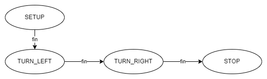

[Accueil](./index.md) > [4M](./acceuil4M.md#projet-7--mouvement-avec-mission)

# 📚 Notes : plusieurs tâches en séquence - la machine à états finis

## Introduction

Dans le domaine de la robotique, le robot autonome peut avoir à choisir quelle tâche accomplir en fonction de son environnement. Par exemple, un robot aspirateur peut avoir à décider s'il doit nettoyer une pièce ou retourner à sa base de recharge. Pour gérer ces situations, on utilise souvent une machine à états finis (_FSM - Finite State Machine_ en anglais) pour décrire les différents états possibles du robot et les transitions entre ces états.

Dans cette leçon, nous allons voir comment représenter une machine à états finis avec un diagramme d'états et comment le programmer pour un microcontrôleur Arduino (ou tout autre microcontrôleur compatible avec le langage C++).

La **machine à états finis** est utile pour choisir une tâche ou une action parmis plusieurs tâches et se concentrer uniquement sur la tâche choisie. Pour accomplir plusieurs tâches ou sous-tâches simultanément, on utilise une autre approche appelée la **multi-tâche**. C'est le sujet de la prochaine leçon. Les deux approches sont souvent combinées pour gérer le fonctionnement d'un robot autonome.

## En bref

**Machine à états finis** (_FSM_) : un système qui, à un moment donné, peut être dans un seul état parmi un nombre défini d'états. Chaque état est associé à un ensemble d'actions et de transitions vers d'autres états.

**Diagramme d'états** : une représentation graphique d'une machine à états finis. Chaque état est représenté par un ovale et chaque transition par une flèche. On peut annoter les flèches avec la condition de transition. Ainsi, le diagramme d'états remplace à très haut niveau le pseudocode pour décrire le comportement du robot.

**Énumération (`enum`)** : un type de données qui permet de définir un ensemble de constantes numériques. C'est utile pour définir les différents états de la machine à états finis parce qu'on peut les nommer de façon descriptive au lieu de se rappeler du chiffre associé.

**Switch-case** : une structure de contrôle qui permet de comparer une variable à une liste de valeurs possibles. C'est une façon plus lisible qu'une structure `if-else if` pour gérer ce type de cas. Dans les FSM, la valeur à comparer est l'état et chaque valeur possible est un état défini dans l'énumération.

## Exemple - robot qui pivote à gauche et à droite puis s'arrête

Imagine un robot qui fait 3 tours à gauche et ensuite 3 tours à droite et finalement s'arrête.

C'est un exemple très simple qu'on peut programmer (_avec raison_) sans une machine à états finis. Mais sa simplicité nous permet de nous concentrer sur les nouveaux éléments de planification et de code qu'on voudra inclure pour gérer des cas plus complexes qui en auraient de besoin.

## Diagramme d'états

Voici le diagramme d'états pour ce robot :



- Tout programme commence à l'état SETUP, ce qui représente tout ce qui se passe avant et dans la fonction setup().
- La condition de transition vers l'état TURN_LEFT est simplement la fin de l'état SETUP.
- C'est la même chose pour les transitions vers les états TURN_RIGHT et STOP.
- L'état STOP est un état final parce qu'il n'y a plus de transitions vers d'autres états. Le robot ne peut pas en sortir, alors c'est une façon de dire que le programme est terminé.

Dans d'autres contextes, c'est possible qu'il y ait des **boucles** dans le diagramme d'états. Par exemple :

- Un robot qui a une batterie à faible charge et doit s'arrêter pour se recharger passe probablement par un état de recharge avant de reprendre ses tâches à un état plus haut dans la chaîne des états.
- Un ascensceur suit un cycle infini à travers des états comme : attendre un appel - se rendre à l'étage de l'appel - ouvrir les portes - attendre un choix d'étage - fermer les portes - se rendre à l'étage choisi - ouvrir les portes - fermer les portes - (retour au début du cycle).

Il pourrait aussi y avoir des **embranchements** dans le diagramme d'états. Par exemple :

- Le robot qui vérifie son état de batterie et se recharge si le niveau est inférieur à un certain seuil ou continue ses tâches si le niveau est suffisant.
- Un robot de recherche et sauvetage qui scanne l'environnement et décide de se déplacer dans la direction de la cible si elle est détéctée ou de se déplacer dans une direction déterminée par un algorithme si la cible n'est pas détectée durant le scan.

### L'extension _Draw.io Integration_ de Henning Dieterichs

Si vous ajoutez l'extension _Draw.io Integration_ à VS Code, vous pouvez produire des diagrammes comme celui ci-dessus directement dans VS Code. Simplement créer un nouveau fichier avec l'extension de fichier `.drawio.png` et l'ouvrir en choisissant Draw.io comme éditeur. Vous aurez accès à la même interface que sur le site web [app.diagrams.net](https://app.diagrams.net/) mais sans avoir à quitter votre environnement de travail ni à télécharger le fichier pour l'inclure dans votre projet.

## Énumération des états

Le code pour déclarer nos états en C++ ressemblerait, en version la plus simple à ceci :

```cpp
// ... directives #include
// ... déclarations d'autres variables globales

enum class States {
  SETUP,
  TURN_LEFT,
  TURN_RIGHT,
  STOP
};

States currentState = States::SETUP;

// ... fonctions setup(), loop() et autres
```

- Le type déclaré est `enum class States`. Avec cette déclaration, nous venons de créer un nouveau type d'objet C++, comme les `int`, `float`, `String`, etc. Notre type s'appelle `States`.
  > C'est possible de déclarer un `enum` sans le mot-clé `class`, mais c'est déconseillé parce que les noms des états ne seront pas nécessairement exclusifs dans le programme ce qui peut introduire des erreurs difficiles à isoler.
- Les états sont listés entre les accolades `{}` et séparés par des virgules `,`. Ils sont généralement écrits en majuscules pour indiquer qu'ils sont des constantes.
- On termine la déclaration de l'énumération avec un point-virgule `;`.
- Parce que `States` est déclarée en dehors de toute fonction, les états sont accessibles de partout dans le code (globalement).
- La variable globale `States currentState` est déclarée pour stocker l'état initial du robot. Notez qu'elle est de type `States` parce que ses valeurs seront limitées à celles déclarées dans l'énumération.
- On assigne des valeurs de type `States` avec la syntaxe `NomDeClasse::NomDeValeur`, dans notre cas `States::SETUP`. Notez les double deux-points entre les identifiants. En arrivant à chaque condition de transition dans le programme, on assigne une nouvelle valeur à cette variable.
  > Un autre avantage de déclarer un `enum class` au lieu d'un simple `enum` est que les outils dans VS Code vous aident à compléter les noms des états. Par exemple, si vous tapez `States::` vous verrez une info-bulle apparaître avec une liste cliquable des états possibles.

Internellement, C++ assigne une valeur entière à chaque état dans l'énumération. Par défaut, la première valeur est 0 et chaque valeur suivante est incrémentée de 1. Ainsi, `SETUP` est 0, `TURN_LEFT` est 1, `TURN_RIGHT` est 2 et `STOP` est 3. **Par défaut, chaque état reçoit une valeur unique**. On peut définir nos propres valeurs si on veut, mais c'est rarement nécessaire pour une FSM où c'est simplement l'identifiant de l'état qui importe.

### Alternative sans `enum`

Sans un `enum` on peut déclarer nos états comme suit mais là on passe du temps à inventer des valeurs pour chaque état et on risque de faire des erreurs :

```cpp
// alternative sans enum - déconseillée
const int SETUP = 0;
const int TURN_LEFT = 1;
const int TURN_RIGHT = 2;
const int STOP = 3;

int currentState = SETUP; // même type que les états (int)
```

## Structure de contrôle switch-case

La fin de la fonction `setup()` est la condition pour la transition vers le prochain état, alors on inclut une mise à jour de l'état à la toute fin de cette fonction. Selon le diagramme d'états, on passe à l'état TURN_LEFT après l'état SETUP :

```cpp
void setup() {
  // code pour l'état SETUP
  currentState = States::TURN_LEFT;
}
```

Ensuite, dans la fonction `loop()`, on fait une cascade conditionnelle pour savoir quel code exécuter en fonction de l'état courant du robot.

### Utiliser `if-else if`

Avec `if-else if`, cela ressemblerait à ceci :

```cpp
void loop() {
  if (currentState == TURN_LEFT) {
    // code pour l'état TURN_LEFT
  } else if (currentState == TURN_RIGHT) {
    // code pour l'état TURN_RIGHT
  } else if (currentState == STOP) {
    // code pour l'état STOP
  }
}
```

On peut voir qu'à chaque fois que la boucle se répète, on vérifie l'état actuel du robot afin de choisir le code approprié à exécuter. Si l'état ne change pas, on exécute le même code à chaque itération de la boucle. Il faut alors inclure un mécanisme pour activer la condition de transition vers le prochain état dans le code pour chaque état.

Cette structure `if-else if` est tout à fait acceptable, mais on se répète beaucoup : la condition est toujours `currentState == ÉTAT`. En plus, ces conditions sont un peu masquées par la structure du code, soit derrière `} else if ()` et on peut avoir de la difficulté à trouver un cas spécifique.

Il y a une meilleure structure pour ce type de comparaison : `switch-case`.

### Utiliser `switch-case`

Avec `switch-case`, la même logique ressemblerait à ceci :

```cpp
void loop() {
  switch (currentState) {
    case TURN_LEFT:
      // code pour l'état TURN_LEFT
      break;
    case TURN_RIGHT:
      // code pour l'état TURN_RIGHT
      break;
    case STOP:
      // code pour l'état STOP
      break;
  }
}
```

C'est immédiatement beaucoup plus lisible, mais il y a quelques détails à noter. Voici la structure générale d'un `switch-case` :

```cpp
switch (variable) {
  case VALEUR1:
    // code pour VALEUR1
    break;
  // autres cas
  default:
    // code pour toutes les autres valeurs
}
```

- `variable` est la variable qu'on veut comparer à des valeurs numériques spécifiques
- chaque cas commence par `case VALEUR1:` où `VALEUR1` est une valeur possible pour `variable`
- le code pour chaque cas est écrit entre `case VALEUR1:` et `break;`
  > Il ne faut pas oublier le mot-clé `break` à la fin de chaque cas. Sinon, le code continuera à **exécuter tous les cas suivants** jusqu'à ce qu'il trouve un `break` ou qu'il arrive à la fin du `switch-case`.
- `default:` est optionnel et représente le cas où `variable` ne correspond à aucune des valeurs spécifiées. C'est une façon de gérer les erreurs ou les cas inattendus.
  > Avec les FSM, on n'utilise pas souvent `default:` parce qu'on se réfère uniquement aux cas déclarés dans l'énumération.

## Tout ensemble

Intégrant les nouveautées pour la FSM et le code que nous avons utilisé pour gérer les déplacements du robot (la bibliothèque personnelle `RobotDrive`), le code pour la FSM pourrait ressembler à ceci :

```cpp
#include <Arduino.h>
#include <RobotDrive.h>

/*
DÉFINIR LES CONNEXIONS MATÉRIELLES
*/
const int millisForOneTurn = 2100; // à calibrer; avec turnLeft() et turnRight()

/*
DÉFINIR LES ÉTATS DU ROBOT
*/
enum class States {
  SETUP,
  TURN_LEFT,
  TURN_RIGHT,
  STOP
};

States currentState = States::SETUP;

void setup() {
  setRobotDrivePins(10, 11);
  currentState = States::TURN_LEFT;
}

void loop() {
  switch (currentState) {
    case States::TURN_LEFT:
      turnLeft();
      delay(3*millisForOneTurn);
      currentState = States::TURN_RIGHT;
      break;
    case States::TURN_RIGHT:
      turnRight();
      delay(3*millisForOneTurn);
      currentState = States::STOP;
      break;
    case States::STOP:
      stop();
      break;
  }
}
```

Vous voyez sans doute que la FSM n'était pas nécessaire ici : on aurait pu simplement décrire les trois tours d'un côté et les trois tours de l'autre dans la fonction `setup()` et laisser la fonction `loop()` vide. Notamment, la condition de transition est simplement la fin de l'état précédent.

En général, la condition de transition est plus complexe que cela. Et certains états doivent gérer plusieurs actions en simultané. C'est là que la FSM devient très utile pour organiser le code. On verra un exemple dans la leçon sur la multi-tâche.

## Pratique

1. Créez un nouveau projet PlatformIO nommé `FSM`.
1. Configurez votre projet en lui ajoutant les bibliothèques nécessaires :
   1. Ajoutez la ligne suivante à son fichier `platformio.ini` : `lib_deps = arduino-libraries/Servo@^1.2.1` afin d'ajouter la bibliothèque externe `Servo` à votre projet.
   1. Copier le dossier `RobotDrive` de vos bibliothèques personnelles dans le dossier `lib` du projet.
1. Copiez le code ci-dessus dans le fichier `/src/main.cpp` et compilez-le pour vérifier qu'il n'y a pas d'erreurs de transcription.
1. Téléversez le code vers votre base robotique à entraînement différentiel et observez le comportement du robot.
1. Calibrez la constante `millisForOneTurn` pour que le robot fasse exactement 3 tours à gauche et 3 tours à droite.
1. Copiez le diagramme d'états plus haut dans le dossier `/src` de votre projet en faisant un clic-droit et en choisissant `Enregistrez l'image sous...` pour le télécharger. C'est un fichier de type `.drawio.png` que vous pouvez ouvrir et modifier avec l'extension _Draw.io Integration_ de VS Code.
1. Définissez un nouvel état de votre choix.
   1. Ajoutez cet état dans l'énumération.
   1. Modifiez le diagramme d'états pour inclure votre nouvel état. Vous devrez avoir :
      - une transition vers cet état
      - une transition de cet état vers un autre état
   1. Ajoutez un cas pour cet état dans la structure `switch-case`.
   1. Modifiez le code pour le faire correspondre au diagramme d'états modifié :
      - changez la transition de l'état précédent vers cet état
      - ajoutez le code actif pour cet état
      - ajoutez une transition de cet état vers le prochain état
