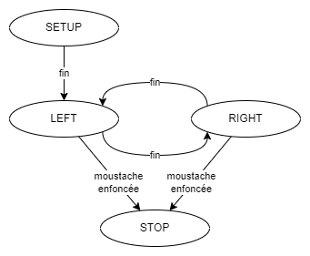

[Accueil](./index.md) > [4M](./acceuil4M.md#projet-7--mouvement-avec-mission)

# 📚 Notes : plusieurs tâches en parallèle (la multi-tâche) - synchroniser avec millis()

## Introduction

Plusieurs programmes que nous avons vus jusqu'à présent utilisent la fonction `delay()` pour gérer le temps entre les différentes actions du robot. Cependànt, cette fonction **bloque le programme** pendant le temps spécifié, ce qui peut être problématique si le robot doit effectuer plusieurs tâches en même temps - comme lire des capteurs, contrôler des moteurs, clignoter des DEL. Dans ce cas, il est préférable d'utiliser une autre approche pour gérer le temps, notamment en utilisant la fonction `millis()`. Par contre, cette fonction vient avec une nouvelle logique de gestion des délais qui est important de comprendre.

## En bref

**bloquer** : arrêter l'exécution du programme pour un certain temps, notamment avec `delay()`

**multi-tâche** : gérer plusieurs tâches en même temps. Avec certain matériel, c'est possible de lancer plusieurs fils d'exécution en parallèle (comme Scratch), mais il y a un seul fil d'exécution possible avec Arduino. Pour faire de la multi-tâche avec Arduino, on doit gérer les tâches en séquence tout en vérifier si c'est le moment de lancer une instruction spécifique.

**millis()** : fonction qui retourne le nombre de millisecondes écoulées depuis le démarrage du programme. On peut l'utiliser pour gérer les intervalles de temps sans bloquer le programme.

**variable locale** : variable déclarée à l'intérieur d'une fonction et qui n'est accessible que dans cette fonction. Elle est détruite à la fin de la fonction sauf si elle est déclarée `static`.

## 🛠️ Pratique - mise en place

> Préparer votre projet maintenant pour le reste des exercices qui suivent à la fin des notes.

1. Créer un nouveau projet PlatformIO nommé `multi-tasking`.
2. Configurez votre projet en lui ajoutant les bibliothèques nécessaires :
   1. Ajoutez la ligne suivante à son fichier `platformio.ini` : `lib_deps = arduino-libraries/Servo@^1.2.1` afin d'ajouter la bibliothèque externe `Servo` à votre projet.
   2. Copier le dossier `RobotDrive` de vos bibliothèques personnelles dans le dossier `lib` du projet.

## Exemple - robot qui dance en tournant avec moustaches comme signal d'arrêt

Imagine un robot qui fait 3 tours à gauche et ensuite 3 tours à droite infiniment, sauf si une de ses moustaches est enfoncée. À ce moment, il devrait arrêter de bouger.

> _Voir <a href="https://www.cs2n.org/u/mp/badge_pages/1746" target="_blank">le tutoriel sur le capteur de moustache</a> pour ajouter les moustaches à votre robot._

Présumant qu'on implémente le code pour ce comportement comme une machine à états finis, le diagramme d'états est plus simple que celui pour le code précédent :



Ici :

- l'état `DANCE` s'occupe d'alterner la direction de pivotement entre gauche et droite à chaque trois secondes, comme si on clignote une DEL.
- la transition de `DANCE` à `STOP` est déclenchée par l'enfoncement d'une moustache (une lecture de capteur).

## Solution avec `delay()`

Avec ce que nous avons vus jusqu'à présent, incluant la bibliothèque personnelle `RobotDrive`, un exemple de code pour le robot de l'exemple pourrait ressembler à ceci :

```cpp
#include <Arduino.h>
#include <RobotDrive.h>

/*
DÉFINIR LES CONNEXIONS MATÉRIELLES
*/

const int rightWhisker = 7;
const int pressed = LOW; // ou 0

/*
DÉFINIR LES ÉTATS DU ROBOT
*/

enum class States {
  SETUP,
  DANCE,
  STOP
};

States currentState = States::SETUP;

/*
DÉCLARATIONS AVANCÉES DES FONCTIONS
*/

void dance();

/*
DÉFINITION DES FONCTIONS DU PROGRAMME
*/

// initialiser le matériel et les connexions
void setup() {
  setRobotDrivePins(10, 11);
  pinMode(rightWhisker, INPUT);
}

// dans une MEF (FSM), sert à vérifier en perpétuité l'état de la machine
void loop() {
  switch (currentState) {
  case States::SETUP:
    currentState = States::DANCE; // transition faite directement
    break;
  case States::DANCE:
    dance(); // appel la fonction pour le code de cet état
    break;
  case States::STOP:
    stop();
    break; // état final : aucune transition
  }
}

// Le code pour l'état States::DANCE
void dance() {
  static const int millisForOneTurn = 2100; // à calibrer; avec turnLeft() et turnRight()

  turnLeft();
  delay(3 * millisForOneTurn);   // attendre 3 tours à gauche
  turnRight();
  delay(3 * millisForOneTurn);  // attendre 3 tours à droite

  if (digitalRead(rightWhisker) == pressed) {
    currentState = States::STOP; // transition faite dans la fonction de l'état
  }
}
```

### Quelques notes sur ce code

Dans ce code, on voit la définition d'une **fonction** pour définir les instructions pour l'état `DANCE`. Voici quelques éléments à noter en lien avec cette décision :

- sortir toutes ces instructions de la structure `switch-case` de `loop()` le rend plus facile à lire.
- parce que la variable `millisForOneTurn` est seulement utilisée dans la fonction `dance()`, on l'a bougé de sa déclaration globale au début du fichier à une déclaration locale dans la fonction `dance()`. Cela rend la fonction plus facile à gérer et plus portable parce que la constante qu'elle utilise est déclarée à l'intérieur de son bloc de code. 
  > On y ajoute le mot-clé `static` pour que la variable soit initialisée une seule fois et conservée entre les appels de la fonction.

Vous pouvez également noter que les **transitions** de la machine à états finis sont déclarées à différents endroits dans le code :

- la transition de l'état `SETUP` à l'état `DANCE` est faite directement dans la structure `switch-case` de `loop()` parce que c'est la seule instruction pour cet état.
- la transition de l'état `DANCE` à l'état `STOP` est faite dans la fonction `dance()` parce que c'est là que la condition pour la transition est vérifiée.
- finalement, l'état `STOP` n'a pas de transition parce que c'est l'état final du robot.

## 🛠️ Pratique - analyse de la solution avec `delay()`

1. Copiez le code ci-dessus dans le fichier `/src/main.cpp` et compilez-le pour vérifier qu'il n'y a pas d'erreurs de transcription.
1. Téléversez le code vers votre base robotique à entraînement différentiel et observez le comportement du robot.
1. Est-ce que vous pouvez fiablement arrêter le robot en enfonçant une moustache?
   - À quel moment est-ce que le robot semble réagir à l'enfoncement de la moustache?
   - Est-ce que le robot s'arrête avant de finir les 3 rotations à gauche ou à droite?
   - Si la moustache n'est pas enfoncée au moment de la transition entre les directions, est-ce que le contact influence le programme?
1. Si vous bouger la condition qui vérifie l'état de la moustache avant les instructions pour les mouvements, est-ce que le robot réagit différemment?

## Introduction à `millis()`

Avec la solution précédente, le problème est que le programme est bloqué durant chaque `delay()`. Notamment, la boucle `loop()` n'est pas en train de se répéter alors on n'arrive pas à l'instruction pour lire les capteurs. Si la moustache est enfoncée pendant un `delay()`, le robot n'est pas en mesure de le détecter.

La solution est de remplacer le code qui bloque le programme (`delay()`) par un code qui lui permet d'itérer en continu tout en respectant les délais voulus. Heureusement, il y a la fonction `millis()` qui nous donnne des lectures de chronomètre en millisecondes depuis le lancemement du programme.

La logique de base pour remplacer `delay()` par `millis()` est la suivante :

```
Est-ce la différence entre maintenant et le temps de référence est plus grande que le délai voulu?
    Si oui, faire la chose voulue et mettre à jour le temps de référence.
    Si non, fait rien.
```

Ça ne semble peut-être pas majeur comme changement, mais ce l'est! Le temps nécessaire pour passer à travers cette sélection est minime et le code suivant s'exécute immédiatement. Quand ce code se trouve dans une boucle, tout le code de la boucle a le temps de se répéter plusieurs fois avant que le délai soit atteint et la tâche voulue est exécutée.

On atteint alors la possibilité d'une vraie multi-tâche, où plusieurs tâches peuvent être gérées en même temps.

### Implémentation de base

Avec la syntaxe Arduino, l'algorithme général ci-dessus donne le code de base suivant :

```cpp
#include <Arduino.h>

const int waitTime = 3000; // 3 secondes, par exemple
unsigned long referenceTime = millis();

void setup() {}

void loop() {
  if (millis() - referenceTime >= waitTime) {
    // code pour la tâche voulue
    referenceTime = millis(); // mettre à jour le temps de référence
  }
}
```

- Notre temps de référence est de type `unsigned long` pour pouvoir contenir les valeurs de 0 à 4,294,967,295 (en millisecondes, c'est environ 50 jours). Un `unsigned int` ne suffirait pas pour des délais de plus de 65 secondes!
- L'appelle à `millis()` nous donne le temps actuel en millisecondes depuis le lancement du programme. On l'utilise chaque fois qu'on a besoin du temps (comme pour initialiser `referenceTime`, pour calculer la différence entre maintenant et `referenceTime` et pour réinitialiser `referenceTime`).

### Implémentation plus robuste

Parce que le code dans `loop()` peut devenir assez complexe avec plusieurs tâches, on tend à écrire une fonction spécifique pour chaque tâche. Cela nous donne la possibilité de gérer les variables liées au délai entièrement à l'intérieur de la fonction, ce qui rend le code plus lisible et plus facile à maintenir.

Voici l'exemple précédent réécrit avec une fonction pour la tâche :

```cpp
#include <Arduino.h>

void doTask(); // déclaration avancée de la fonction

void setup() {}

void loop() {
  doTask();
}

void doTask() {
  static const int waitTime = 3000; // 3 secondes, par exemple
  static unsigned long referenceTime = millis();

  if (millis() - referenceTime >= waitTime) {
    // code pour la tâche voulue
    referenceTime = millis(); // mettre à jour le temps de référence
  }
}
```

- Si on définit la fonction après `loop()`, on doit déclarer la fonction avant `loop()` pour que le compilateur sache qu'elle existe. C'est ce que fait la ligne `void doTask(); // déclaration avancée de la fonction`.
- Les variables `waitTime` et `referenceTime` sont maintenant des variables locales à la fonction `doTask()`. Elles sont `static` pour être :
    - déclarées et initialisées une seule fois : quand la fonction est initialement chargée en mémoire
    - conservées entre les appels de la fonction (contrairement à des variables locales normales qui sont détruites à la fin de la fonction)
- Pour ajouter des tâches supplémentaires, il suffit de copier-coller la fonction `doTask()` sans même changer les noms des varaibles internes à la fonction, soit les **variables locales**. Parce que ces variables sont seulement accessibles dans la fonction où elles sont déclarées, des variables avec le même nom dans différentes fonctions ne seront pas confondues.

#### 🛠️ Pratique - tester rapidement l'implémentation avec `millis()`

1. Créez un nouveau projet PlatformIO nommé `millis-test`.
1. Copiez le code ci-dessous dans le fichier `/src/main.cpp` et le transférez vers une carte Arduino (comme celle dans votre robot).
1. Vérifier que le DEL intégré clignote toutes les 0.5 secondes.

```cpp
#include <Arduino.h>

void blink();

void setup() {
  pinMode(13, OUTPUT);
  digitalWrite(13, HIGH);
}

void loop() {
  blink();
}

void blink() {
  static const int waitTime = 500; 
  static unsigned long referenceTime = millis();

  if (millis() - referenceTime >= waitTime) {
    digitalWrite(13, !digitalRead(13));
    referenceTime = millis(); // mettre à jour le temps de référence
  }
}
```

> Notez l'astuce pour la ligne `digitalWrite(13, !digitalRead(13));` : `!` est l'opérateur de négation logique qui inverse la valeur d'une variable booléenne. Alors chaque fois qu'on passe sur cette instruction, on donne  au DEL (avec `digitalWrite`) l'état inverse de ce qu'il avait (obtenu avec `digitalRead`).

## Solution avec `millis()`

Revenant à l'exemple du robot qui dance en tournant avec moustaches comme signal d'arrêt, voici une solution qui utilise `millis()` pour gérer les délais :

```cpp
#include <Arduino.h>
#include <RobotDrive.h>

/*
DÉFINIR LES CONNEXIONS MATÉRIELLES
*/

const int rightWhisker = 7;
const int pressed = LOW; // ou 0

/*
DÉFINIR LES ÉTATS DU ROBOT
*/

enum class States {
  SETUP,
  DANCE,
  STOP
};

States currentState = States::SETUP;

/*
DÉCLARATIONS AVANCÉES DES FONCTIONS
*/

void dance();

/*
DÉFINITION DES FONCTIONS DU PROGRAMME
*/

// initialiser le matériel et les connexions
void setup() {
  setRobotDrivePins(10, 11);
  pinMode(rightWhisker, INPUT);
  turnLeft(); // initialiser le mouvement
}

// dans une MEF (FSM), sert à vérifier en perpétuité l'état de la machine
void loop() {
  switch (currentState) {
  case States::SETUP:
    currentState = States::DANCE; // transition faite directement
    break;
  case States::DANCE:
    dance(); // appel la fonction pour le code de cet état
    break;
  case States::STOP:
    stop();
    break; // état final : aucune transition
  }
}

// Le code pour l'état States::DANCE
void dance() {
  static const int millisForOneTurn = 2100; // à calibrer; avec turnLeft() et turnRight()
  static byte toLeft = 1; // direction de rotation

  static unsigned long referenceTime = millis(); // temps de référence
  
  // vérifie s'il faut changer la direction
  if (millis() - referenceTime >= 3 * millisForOneTurn) {
    if (toLeft) {
      turnLeft();
    } else {
      turnRight();
    }
    toLeft = !toLeft; // change la direction
    referenceTime = millis(); // mettre à jour le temps de référence
  }

  // vérifie s'il faut changer l'état
  if (digitalRead(rightWhisker) == pressed) {
    currentState = States::STOP;
  }
}
```
### Quelques notes sur ce code

- Parce que la fonction `dance()` attend avant de donner une nouvelle instruction de mouvement, il faut donner une première instruction de mouvement dans `setup()` afin qu'il se mette en mouvement immédiatement. Sinon il faudrait attendre le premier délai de `3 * millisForOneTurn` avant de voir le robot bouger.
- Parce que le délai est géré dans un bloc `if` et non dans une séquence d'instructions incluant `delay()`, il faut un autre mécanisme pour alterner la direction de rotation : on a ajouté une variable `toLeft` qui est `static` pour être conservée entre les appels de la fonction `dance()`. Sa valeur s'inverse (entre 1 et 0) à chaque fois que le délai est atteint.

## 🛠️ Pratique - analyse de la solution avec `millis()`

1. Remplacer le code dans `/src/main.cpp` du projet `multi-tasking` que nous avons initialisé avec une solution utilisant `delay()` par le code ci-dessus.
1. Compilez le code pour vérifier qu'il n'y a pas d'erreurs de transcription.
1. Téléversez le code vers votre base robotique à entraînement différentiel et observez le comportement du robot.
1. Est-ce que vous pouvez maintenant fiablement arrêter le robot en enfonçant une moustache?
    - À quel moment est-ce que le robot semble réagir à l'enfoncement de la moustache?
    - Est-ce que le robot s'arrête avant de finir les 3 rotations à gauche ou à droite?
    - Si la moustache n'est pas enfoncée au moment de la transition entre les directions, est-ce que le contact influence le programme?
